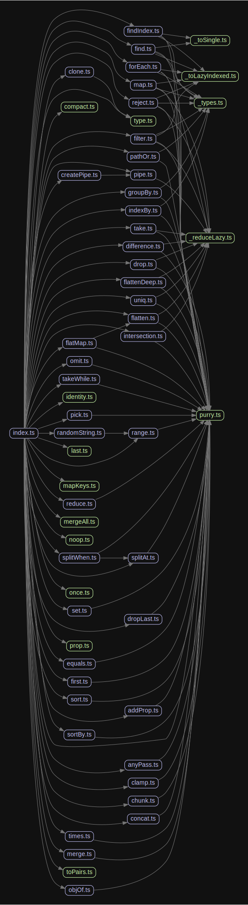

# 源码分析

## 文件结构

``` bash
/Users/liufang/openSource/FunnyLiu/remeda
├── LICENSE
├── README.md
├── src
|  ├── _counter.ts
|  ├── _reduceLazy.ts
|  ├── _toLazyIndexed.ts
|  ├── _toSingle.ts
|  ├── _types.ts
|  ├── addProp.ts
|  ├── allPass.ts
|  ├── anyPass.ts
|  ├── chunk.ts
|  ├── clamp.ts
|  ├── clone.ts
|  ├── compact.ts
|  ├── concat.ts
|  ├── createPipe.ts
|  ├── difference.ts
|  ├── drop.ts
|  ├── dropLast.ts
|  ├── equals.ts
|  ├── filter.ts
|  ├── find.ts
|  ├── findIndex.ts
|  ├── first.ts
|  ├── flatMap.ts
|  ├── flatten.ts
|  ├── flattenDeep.ts
|  ├── forEach.ts
|  ├── forEachObj.ts
|  ├── groupBy.ts
|  ├── identity.ts
|  ├── index.ts
|  ├── indexBy.ts
|  ├── intersection.ts
|  ├── last.ts
|  ├── map.ts
|  ├── mapKeys.ts
|  ├── merge.ts
|  ├── mergeAll.ts
|  ├── noop.ts
|  ├── objOf.ts
|  ├── omit.ts
|  ├── once.ts
|  ├── pathOr.ts
|  ├── pick.ts
|  ├── pipe.ts
|  ├── prop.ts
|  ├── purry.ts
|  ├── randomString.ts
|  ├── range.ts
|  ├── reduce.ts
|  ├── reject.ts
|  ├── set.ts
|  ├── sort.ts
|  ├── sortBy.ts
|  ├── splitAt.ts
|  ├── splitWhen.ts
|  ├── take.ts
|  ├── takeWhile.ts
|  ├── times.ts
|  ├── toPairs.ts
|  ├── type.ts
|  └── uniq.ts
├── tsconfig.json
└── yarn.lock

```

## 外部模块依赖

请在： http://npm.broofa.com?q=remeda 查看

## 内部模块依赖


  